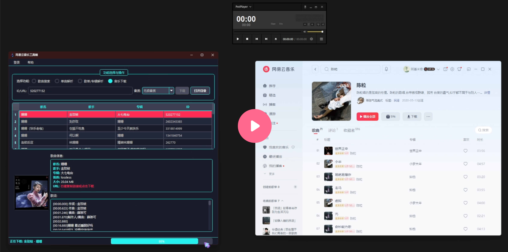

# Netease Downloader: 网易云音乐无损/高品质下载器

[简体中文](./README.md) | [English](./README_en.md)

[](https://github.com/toki-plus/netease-downloader/stargazers)
[](https://github.com/toki-plus/netease-downloader/network/members)
[](https://github.com/toki-plus/netease-downloader/pulls)
[](https://choosealicense.com/licenses/mit/)

**`Netease Downloader` 是一款优雅、高效的网易云音乐下载工具，专为追求极致音质和便捷体验的音乐爱好者打造。** 它提供了一个现代化的图形界面，集**搜索、解析、多音质下载、元数据写入**于一体，让您轻松获取并管理您喜爱的音乐。

本项目旨在解决传统下载工具界面陈旧、功能单一、登录繁琐等痛点，提供一个功能全面、操作直观的一站式解决方案。

<p align="center">
  <a href="https://www.bilibili.com" target="_blank">
    
  </a>
  <br>
  <em>(点击封面图跳转到 B 站观看高清演示视频)</em>
</p>

---

## ✨ 核心功能

本项目通过四大核心模块，为您带来流畅的音乐获取体验：

### 🎵 多维度音乐解析引擎 (Multi-Dimensional Parsing Engine)

-   **关键词搜索**: 输入歌曲名或歌手，快速搜索相关歌曲，结果以清晰的列表展示。
-   **单曲精准解析**: 支持输入歌曲的ID或URL链接，直接解析特定歌曲的详细信息。
-   **歌单/专辑批量解析**: 只需一个歌单或专辑的ID/URL，即可一键解析其中包含的所有歌曲，方便批量操作。

### 💎 高品质无损下载 (High-Quality & Lossless Download)

-   **多音质选项**: 支持从`标准`、`极高`到`无损`、`Hi-Res`，乃至`高清环绕声`、`超清母带`等多种音质选择，满足您对音质的极致追求。
-   **多线程下载**: 底层采用多线程架构，下载任务在后台高效执行，界面保持流畅响应，并提供实时进度条反馈。
-   **智能文件名处理**: 自动根据“歌手 - 歌名”格式生成文件名，并对特殊字符进行过滤，确保文件名的规范与兼容性。

### 🏷️ 自动化的元数据写入 (Automated Metadata Tagging)

-   **ID3信息注入**: 下载完成后，工具会自动将**歌曲名、歌手、专辑、封面、音轨号**等元数据（ID3 Tags）写入音乐文件。
-   **专辑封面嵌入**: 自动获取并嵌入高清专辑封面，让您的音乐库在任何播放器中都整洁美观。
-   **多格式支持**: 完美支持为 `MP3`, `FLAC`, `M4A` 等主流音频格式写入元数据。

### 🖥️ 现代化的图形界面 (Modern GUI)

-   **扫码登录**: 集成二维码登录功能，只需用网易云音乐App扫码即可安全登录，自动管理Cookie，告别手动输入的繁琐。
-   **直观的工作流**: 界面清晰地划分为`歌曲搜索`、`单曲解析`、`歌单/专辑解析`和`音乐下载`四大功能区，操作逻辑一目了然。
-   **实时信息预览**: 解析或选中歌曲后，可立即预览专辑封面、详细信息及歌词，方便确认。
-   **跨平台设计**: 基于 `PyQt5` 构建，具备良好的跨平台潜力。

## 📸 软件截图

<p align="center">
  
  <br>
  <em>软件主界面：集成了搜索、解析、下载等核心功能，操作直观便捷。</em>
</p>

## 🚀 快速开始

### 系统要求

1.  **操作系统**: Windows / macOS / Linux (已在Windows下充分测试)。
2.  **Python**: 3.8 或更高版本。

### 安装与启动

1.  **克隆本仓库：**
    ```bash
    git clone https://github.com/toki-plus/netease-downloader.git
    cd netease-downloader
    ```

2.  **创建并激活 Python 虚拟环境 (推荐)：**
    ```bash
    python -m venv venv
    # Windows 系统
    venv\Scripts\activate
    # macOS/Linux 系统
    source venv/bin/activate
    ```

3.  **安装依赖库：**
    ```bash
    pip install -r requirements.txt
    ```

4.  **运行程序：**
    ```bash
    python main.py
    ```

## 📖 使用指南

1.  **首次登录 (推荐)**:
    -   点击菜单栏的 `登录` -> `二维码登录`。
    -   使用手机上的网易云音乐App扫描弹出的二维码，并确认登录。
    -   成功后，状态栏会显示“状态: 已登录”，此时您可以下载会员歌曲或更高音质的音乐。

2.  **搜索歌曲**:
    -   选择 `歌曲搜索` 功能，输入关键词，点击 `搜索`。
    -   搜索结果会显示在下方的表格中。

3.  **解析与预览**:
    -   **双击**表格中的任意一首歌曲，程序会自动切换到 `单曲解析` 模式，并开始解析该歌曲。
    -   解析完成后，您可以在下方预览歌曲的封面、详细信息和歌词。

4.  **下载歌曲**:
    -   切换到 `音乐下载` 功能。
    -   输入您想下载的歌曲ID或URL（可以直接从预览区复制，或从网易云官方分享）。
    -   选择期望的**音质**。
    -   点击 `下载` 按钮，状态栏的进度条会显示下载进度。
    -   下载完成后，点击 `打开目录` 即可查看已下载的音乐文件。

5.  **批量下载**:
    -   选择 `歌单/专辑解析` 功能，输入歌单或专辑的ID/URL。
    -   点击 `解析列表`，该列表下的所有歌曲将出现在表格中。
    -   之后您可以逐个双击预览，或切换到 `音乐下载` 模式，手动输入ID进行下载。

---

<p align="center">
  <strong>业务定制与技术交流，请添加：</strong>
</p>
<table align="center">
  <tr>
    <td align="center">
      
      <br />
      <sub><b>个人微信</b></sub>
      <br />
      <sub>微信号: toki-plus (请备注“GitHub定制”)</sub>
    </td>
    <td align="center">
      
      <br />
      <sub><b>公众号</b></sub>
      <br />
      <sub>获取最新技术分享</sub>
    </td>
  </tr>
</table>

## 📂 我的其他开源项目

-   **[AI-Trader-For-MT4](https://github.com/toki-plus/ai-trader-for-mt4)**: 革命性开源框架，将大语言模型（LLM）转变为能在MetaTrader 4（MT4）平台上进行自主交易的AI代理。
-   **[Auto USPS Tracker](https://github.com/toki-plus/auto-usps-tracker)**: 专为跨境电商卖家设计的高效USPS批量物流追踪器，支持防屏蔽抓取并生成精美Excel报告。
-   **[AI Mixed Cut](https://github.com/toki-plus/ai-mixed-cut)**: 颠覆性AI内容生产工具，通过“解构-重构”模式将现有视频深度解析并全自动生成全新原创短视频。
-   **[AI Video Workflow](https://github.com/toki-plus/ai-video-workflow)**: 全自动AI原生视频生成工作流，集成文生图、图生视频和文生音乐模型，一键创作AIGC短视频。
-   **[AI Highlight Clip](https://github.com/toki-plus/ai-highlight-clip)**: AI驱动的智能剪辑工具，全自动从长视频分析、提取“高光时刻”，并生成爆款标题。
-   **[AI TTV Workflow](https://github.com/toki-plus/ai-ttv-workflow)**: AI驱动的文本转视频工具，自动将文案转化为带配音、字幕和封面的短视频，支持文案提取/二创/翻译。
-   **[AB Video Deduplicator](https://github.com/toki-plus/AB-Video-Deduplicator)**: 创新“高帧率抽帧混合”技术，重构视频数据指纹，规避短视频平台原创度检测/查重机制。
-   **[Video Mover](https://github.com/toki-plus/video-mover)**: 全自动化内容创作流水线，自动监听下载视频、多维度去重、AI生成标题，一键发布多平台。

## 🤝 参与贡献

欢迎任何形式的贡献！如果你有新的功能点子、发现了Bug，或者有任何改进建议，请：
-   提交一个 [Issue](https://github.com/toki-plus/ai-trader-for-mt4/issues) 进行讨论。
-   Fork 本仓库并提交 [Pull Request](https://github.com/toki-plus/ai-trader-for-mt4/pulls)。

如果这个项目对你有帮助，请不吝点亮一颗 ⭐！

## 📜 开源协议

本项目基于 MIT 协议开源。详情请见 [LICENSE](LICENSE) 文件。